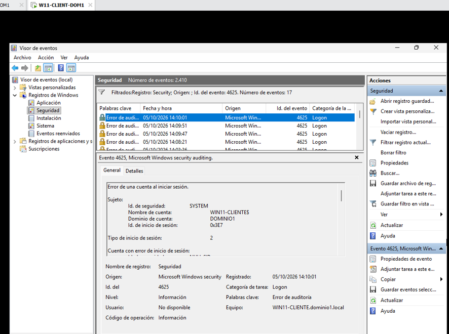
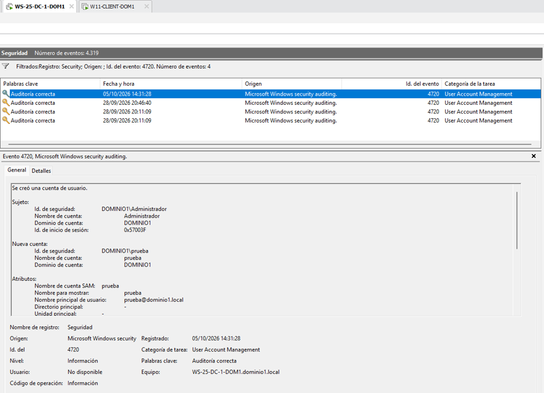
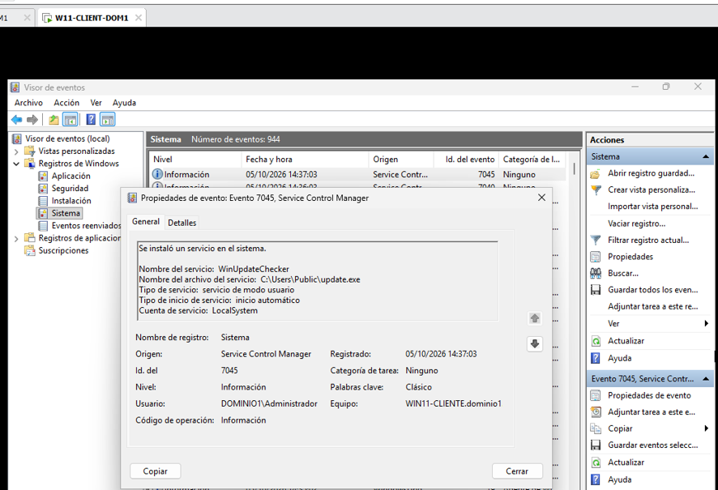
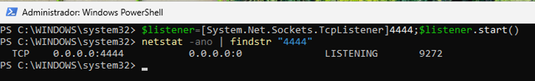
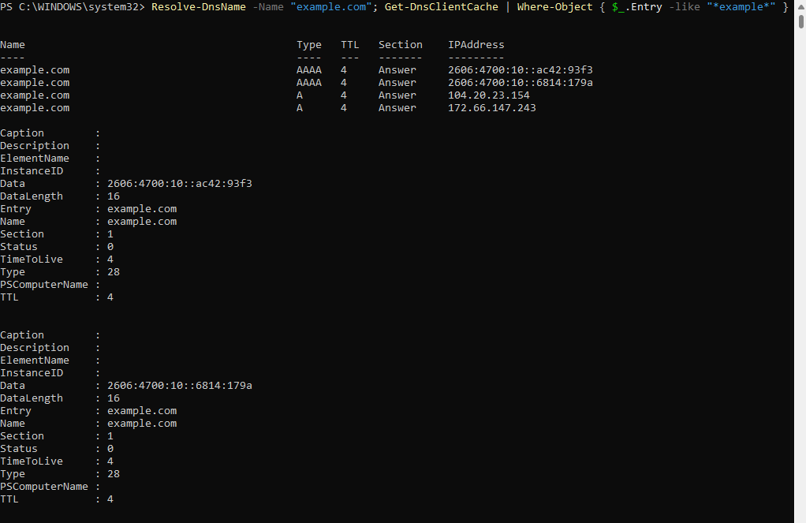

#  Casos Prácticos de Triaje y Análisis Inicial: SOC Junior

##  Objetivo
El propósito de este laboratorio es desarrollar el criterio y la metodología analítica de un perfil **SOC Junior (Nivel 1)** ante alertas frecuentes de seguridad[cite: 8, 15]. Se evalúa la procedencia de los datos, el contraste de hipótesis para descartar falsos positivos y la justificación técnica necesaria para escalar un incidente hacia equipos de respuesta especializada (Tier 2 / DFIR)[cite: 7, 8].

##  Entorno de Laboratorio
* **Sistemas implicados:** Controlador de Dominio Windows Server (`WS-25-DC-1-DOM1`) y estación cliente Windows 11 (`WIN11-CLIENTE`)[cite: 6].
* **Alcance:** Segmento virtual privado aislado (Host-Only). Pruebas y generación de eventos realizadas bajo autorización expresa con fines formativos[cite: 7].

---

##  Resumen Forense de Casos

| Caso / Escenario | Origen de Telemetría | Evidencia Primaria | Riesgo Potencial Evaluado | Criterio Clave de Descarte (FP) |
| :--- | :--- | :--- | :--- | :--- |
| **1. Intentos fallidos de login** | `Security.evtx` (Cliente / DC)[cite: 6] | Event ID 4625 (`Substatus: 0xC000006A`)[cite: 6, 7] | Ataque de fuerza bruta / Password spraying[cite: 7] | Dispositivo móvil o script con clave antigua en caché[cite: 7, 8] |
| **2. Usuario creado** | `Security.evtx` (DC) | Event ID 4720 (`TargetUserName`)[cite: 8] | Persistencia o cuenta puente (*backdoor*)[cite: 7, 8] | Existencia de ticket aprobado de Recursos Humanos / TI[cite: 8] |
| **3. Servicio sospechoso activo** | `System.evtx` (Endpoint) | Event ID 7045 (`ImagePath: \Users\Public`)[cite: 8] | Persistencia con privilegios de sistema (`SYSTEM`)[cite: 6, 8] | Software de gestión o soporte desplegado legítimamente |
| **4. Puerto inesperado abierto** | Sockets de red (Host / Nmap)[cite: 8] | TCP `0.0.0.0:4444` en `LISTENING` (PID)[cite: 11] | Shell reversa a la escucha (*bind shell*)[cite: 8] | Servicio de desarrollo local vinculado exclusivamente a `127.0.0.1` |
| **5. Conexión a dominio externo** | Cliente DNS / Proxy / Sockets[cite: 8] | Registros DNS (`A`/`AAAA`), HTTP 200 saliente[cite: 14] | Balizamiento C2 (*Command & Control*) / Exfiltración[cite: 8] | Tráfico generado por navegador estándar hacia CDN/web conocida[cite: 8] |

---

##  Análisis Detallado de Escenarios

### Caso 1: Intentos fallidos de login[cite: 8]
* **Qué ha pasado:** Se han registrado múltiples intentos consecutivos de inicio de sesión con contraseña errónea contra una cuenta de dominio[cite: 6, 8].
* **Dónde lo detecto:** En el Visor de Eventos del cliente (`WIN11-CLIENTE`), registro de **Seguridad**, bajo el **Event ID 4625** (y en el DC mediante el **Event ID 4740** si se dispara el bloqueo por política GPO)[cite: 6, 8].
* **Qué evidencia tengo:**[cite: 8]
  * Marca temporal exacta de los intentos fallidos[cite: 6, 7].
  * Cuenta objetivo: `TargetUserName: deniz.auditor`[cite: 6].
  * Estación origen: `WorkstationName: WIN11-CLIENTE`[cite: 6].
  * Diagnóstico de subestado: `Substatus: 0xC000006A` (contraseña incorrecta)[cite: 6, 7].
* **Qué riesgo podría tener:** Ataque de fuerza bruta en línea, prueba masiva de contraseñas o denegación de servicio interna por bloqueo sistemático de identidades legítimas[cite: 6, 7, 8].
* **Qué haría como primer análisis:** Analizar la frecuencia temporal de los registros (diferenciar cadencias en milisegundos de acciones manuales de un usuario), verificar si el empleado cambió su contraseña recientemente y mantiene aplicaciones desactualizadas en segundo plano, y contactar con el titular mediante un canal corporativo alternativo[cite: 7, 8].
* **Cuándo lo escalaría:** Si la dirección IP origen es externa o no reconocida, si los ataques van dirigidos a cuentas privilegiadas (`Administrator`, `Domain Admins`), o si inmediatamente después de los fallos se genera un **Event ID 4624** (inicio exitoso) desde el mismo origen sin justificación del usuario[cite: 6, 7, 8].

> 

---

### Caso 2: Usuario creado[cite: 8]
* **Qué ha pasado:** Se ha registrado el alta de una nueva cuenta de usuario en el Directorio Activo de forma directa[cite: 6, 8].
* **Dónde lo detecto:** En el registro de **Seguridad** del Controlador de Dominio (`WS-25-DC-1-DOM1`), mediante el **Event ID 4720** (*A user account was created*)[cite: 6, 8].
* **Qué evidencia tengo:**[cite: 8]
  * Nombre de la cuenta creada: `TargetUserName: temp.support`.
  * Identidad responsable de la creación: `SubjectUserName: Administrador`[cite: 6].
  * Fecha, hora exacta y SID del nuevo objeto en el dominio[cite: 7].
* **Qué riesgo podría tener:** Establecimiento de persistencia secundaria tras el compromiso de credenciales administrativas o incumplimiento de procedimientos formales de gobierno de identidades[cite: 7, 8].
* **Qué haría como primer análisis:** Contrastar el identificador del creador con el sistema de gestión de incidencias/solicitudes (ITSM) para verificar si existe un ticket autorizado de alta, y revisar de forma inmediata si se registraron eventos posteriores de inclusión en grupos administrativos (**Event IDs 4728 / 4732**)[cite: 7, 8].
* **Cuándo lo escalaría:** Si no existe registro administrativo que respalde la creación, si el evento ocurre fuera del horario operativo sin notificación previa, o si la cuenta nueva recibe privilegios de administración local o de dominio[cite: 7, 8].

> 

---

### Caso 3: Servicio sospechoso activo[cite: 8]
* **Qué ha pasado:** Se ha instalado un nuevo servicio en el sistema operativo cuya ruta binaria apunta a un directorio público no estándar[cite: 8].
* **Dónde lo detecto:** En el Visor de Eventos del endpoint (`WIN11-CLIENTE`), dentro del registro de **Sistema**, mediante el **Event ID 7045** (*A service was installed in the system*) originado por el *Service Control Manager*[cite: 6, 8].
* **Qué evidencia tengo:**[cite: 8]
  * Nombre del servicio: `Service Name: WinUpdateChecker`.
  * Ruta del ejecutable: `ImagePath: C:\Users\Public\update.exe`[cite: 8].
  * Nivel de privilegios del servicio: `LocalSystem`[cite: 6, 8].
* **Qué riesgo podría tener:** Persistencia de malware con los máximos privilegios locales del sistema operativo, ejecución automática en el arranque o presencia de puertas traseras[cite: 8].
* **Qué haría como primer análisis:** Localizar el ejecutable en disco, calcular su hash SHA-256 (`Get-FileHash`), contrastarlo en plataformas de inteligencia de amenazas (VirusTotal) y verificar si cuenta con una firma digital corporativa válida[cite: 8].
* **Cuándo lo escalaría:** Si el binario carece de firma legítima, arroja coincidencias maliciosas en bases de firmas o se detecta que el proceso asociado intenta iniciar conexiones de red hacia el exterior[cite: 8].

> 

---

### Caso 4: Puerto inesperado abierto[cite: 8]
* **Qué ha pasado:** El host mantiene un puerto de red en estado de escucha (`LISTENING`) sin relación con las funciones normales del equipo[cite: 8, 11].
* **Dónde lo detecto:** Mediante auditoría local de sockets con herramientas del sistema operativo (`netstat -ano`) o mediante escaneo defensivo de red con Nmap[cite: 8, 11].
* **Qué evidencia tengo:**[cite: 8]
  * Socket activo: `0.0.0.0:4444` (accesible en todas las interfaces de red)[cite: 11].
  * Protocolo: `TCP`[cite: 11].
  * Proceso y contexto: Identificador de proceso `PID: 9272` correspondiente al intérprete de comandos en memoria[cite: 11].
* **Qué riesgo podría tener:** Exposición de una interfaz remota no autorizada (*listener* para shells interactivas), vector de explotación remota y ampliación de la superficie de ataque del puesto[cite: 8].
* **Qué haría como primer análisis:** Identificar el binario y la línea de comandos completa vinculada al PID mediante el Administrador de Tareas o PowerShell (`Get-Process -Id 9272`), determinar si el puerto recibe conexiones externas y verificar la directiva del firewall de host[cite: 8, 11].
* **Cuándo lo escalaría:** Si el proceso corresponde a herramientas de administración remota no estándar, scripts no autorizados, o si se aprecian conexiones activas establecidas desde IPs no corporativas[cite: 8].

> 

---

### Caso 5: Conexión a dominio externo[cite: 8]
* **Qué ha pasado:** El sistema ha ejecutado una consulta de resolución de nombres y un establecimiento de canal HTTP saliente hacia un destino público externo[cite: 8, 14].
* **Dónde lo detecto:** En el resolvedor local del sistema operativo (`Resolve-DnsName`, `Get-DnsClientCache`), en registros de proxy/firewall de salida perimetral o mediante telemetría de consultas DNS (Sysmon Event ID 22)[cite: 8, 14].
* **Qué evidencia tengo:**[cite: 8]
  * Dominio consultado y registros resueltos: `example.com` (`A`: `172.66.147.243`, `104.20.23.154`)[cite: 14].
  * Solicitud saliente: `curl.exe` recibiendo cabecera de confirmación `HTTP/1.1 200 OK`[cite: 14].
  * Marca de tiempo y equipo emisor (`WIN11-CLIENTE`)[cite: 6, 8, 14].
* **Qué riesgo podría tener:** Tráfico de control de malware (*C2 beaconing*), descarga de módulos secundarios (*payload stagers*) o potencial fuga de información[cite: 8].
* **Qué haría como primer análisis:** Consultar la reputación, categorización y fecha de registro del dominio en plataformas OSINT (VirusTotal, Whois, AbuseIPDB), inspeccionar qué proceso inició la llamada a la red (diferenciar un navegador web de utilidades de consola o scripts) y revisar si existen patrones de reintento periódicos con intervalos fijos (*jitter*)[cite: 8].
* **Cuándo lo escalaría:** Si el dominio muestra reputación maliciosa confirmada, si la comunicación es originada por binarios del sistema anómalos (como `powershell.exe` o `rundll32.exe`) sin interacción de usuario, o si se detecta transferencia sostenida de datos hacia el destino[cite: 8].

> 
